# Himpun

[](https://github.com/MrPrinceAli/himpun/actions/workflows/ci.yml)
[](LICENSE)
[](smart-contract/)
[](smart-contract/)
[](frontend/)
[](frontend/)

Transparent fundraising on Ethereum. Donations are held by a smart contract, and every withdrawal by the fundraiser must be approved by the donors through an on-chain vote.

> _Himpun_ is Indonesian for "to gather" — money gathered together, and decisions made together.

## Table of contents

- [Screenshots](#screenshots)
- [Project structure](#project-structure)
- [Features](#features)
- [Platform rules](#platform-rules)
- [Requirements](#requirements)
- [Running locally](#running-locally)
- [MetaMask setup](#metamask-setup)
- [Frontend configuration](#frontend-configuration-frontendenvlocal)
- [Commands](#commands)
- [Continuous integration](#continuous-integration)
- [Troubleshooting](#troubleshooting)
- [License](#license)
- Separate documents (written in Indonesian): [platform rules in detail](docs/ATURAN.md) · [architecture](docs/ARSITEKTUR.md)

## Screenshots

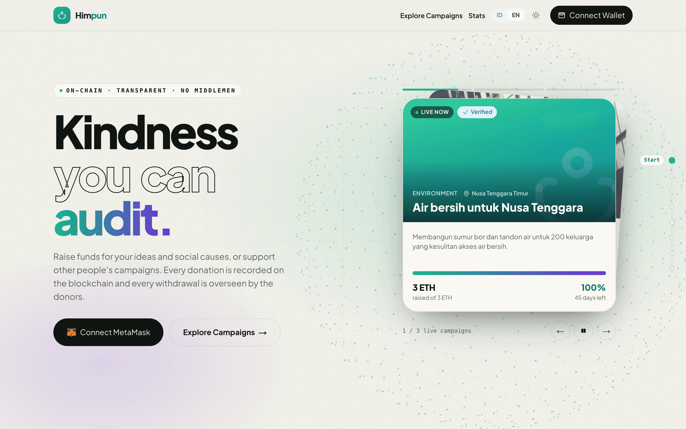

| Explore campaigns                                                                                                        | Campaign page                                                                                              |
| ------------------------------------------------------------------------------------------------------------------------ | ---------------------------------------------------------------------------------------------------------- |
| 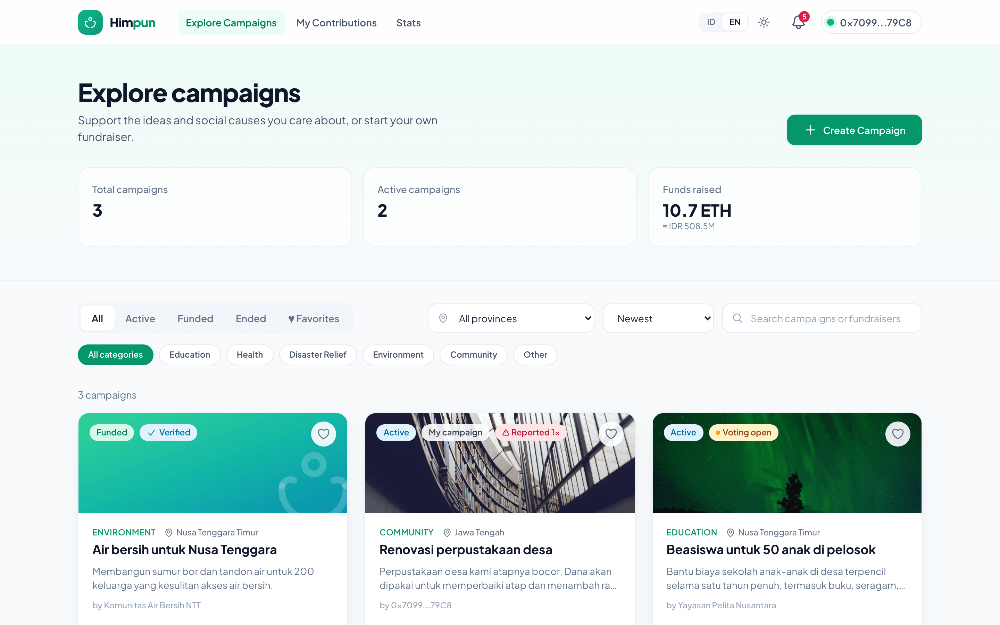                                                                       | 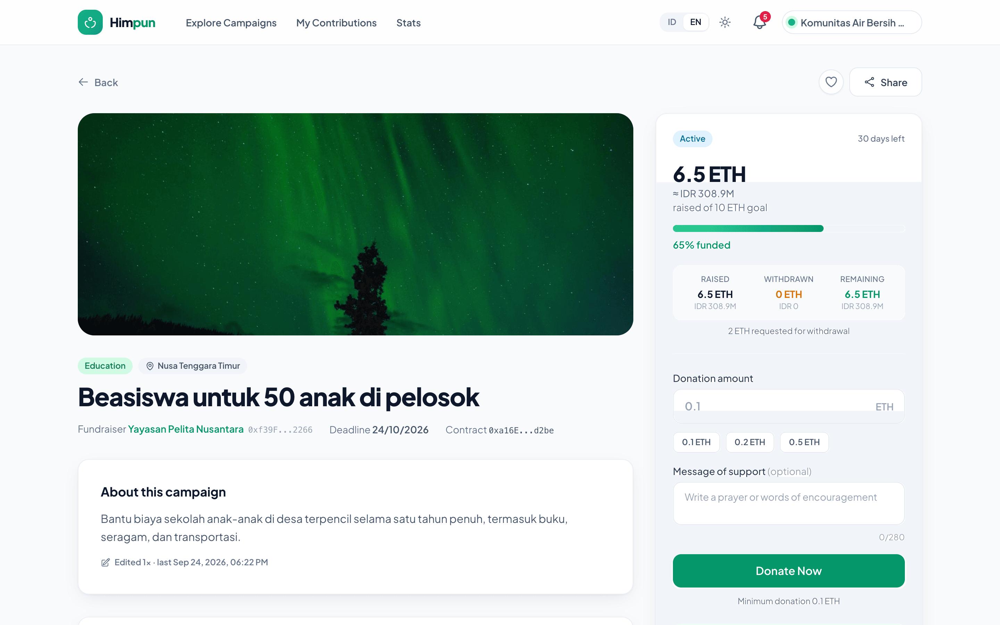                                                            |
| Filter by status, category and province, search, sort, and favorites. Every number is read straight from the blockchain. | Progress, donate panel with a message of support, donors, fundraiser updates, and a full activity history. |

**Withdrawal voting**, the core rule of the platform: donors approve or reject every withdrawal request before any funds leave the contract.

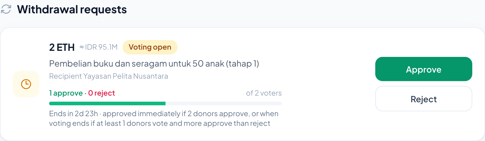

| Platform stats                                                                                    | Admin panel                                                                |
| ------------------------------------------------------------------------------------------------- | -------------------------------------------------------------------------- |
| 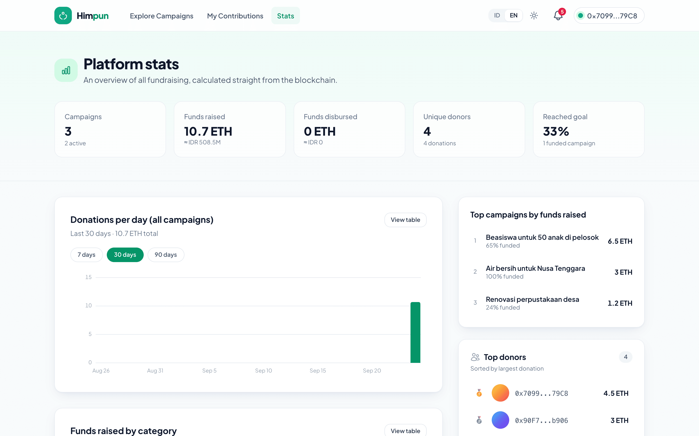                                                     | 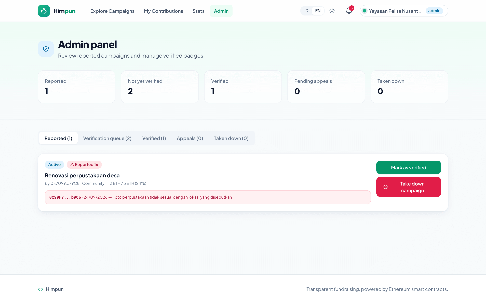                                 |
| Funds raised, unique donors, donations per day, funds per category, top campaigns and top donors. | Reported campaigns, verification queue, appeals, and taken-down campaigns. |

| Fundraiser profile                                                           | Dark mode                                                         |
| ---------------------------------------------------------------------------- | ----------------------------------------------------------------- |
| 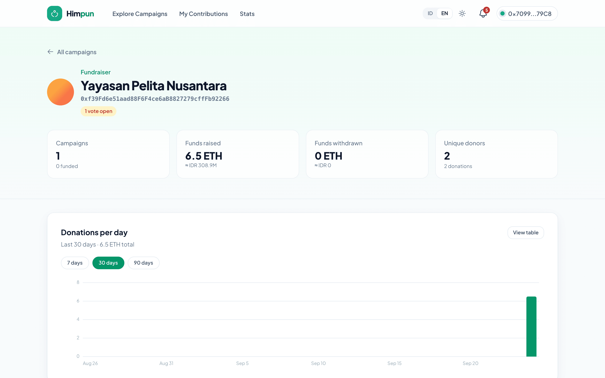                          | 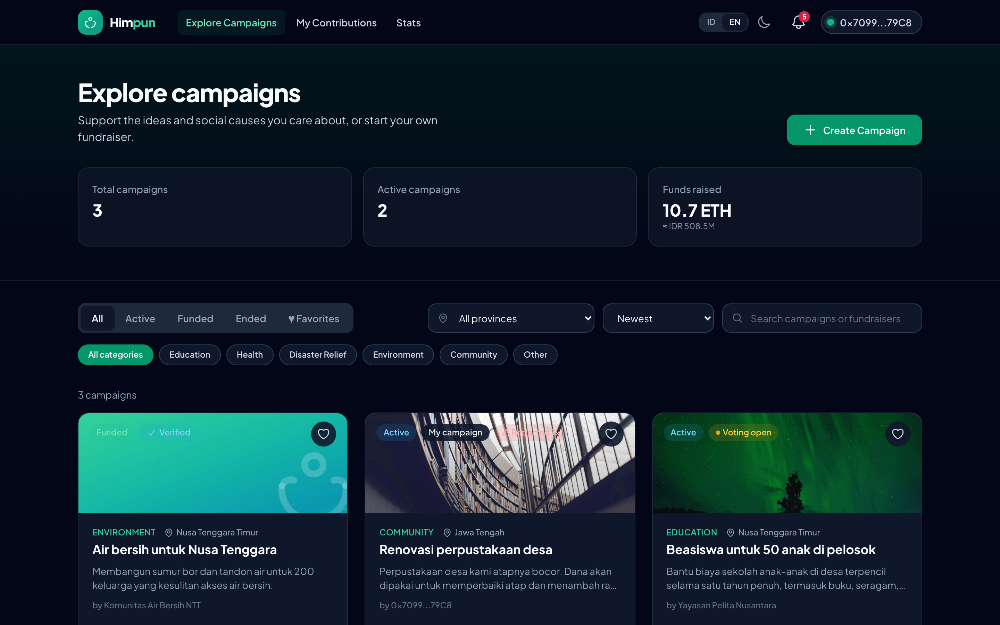                           |
| Total raised, unique donors, and a daily donation chart for each fundraiser. | Indonesian / English and light / dark, remembered in the browser. |

**On mobile**

<p>
  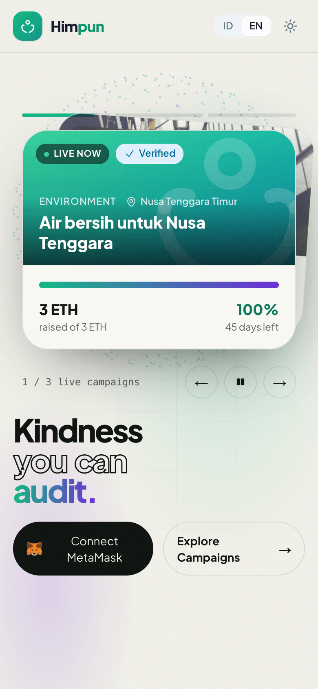
  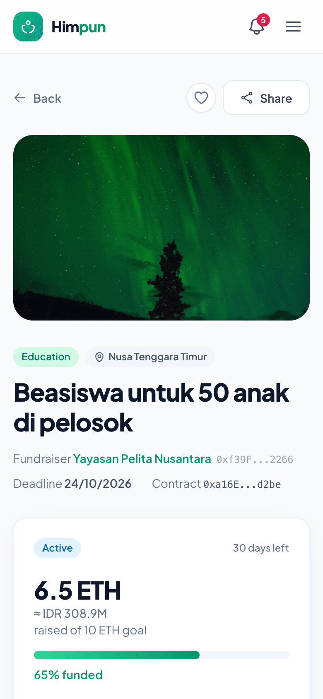
  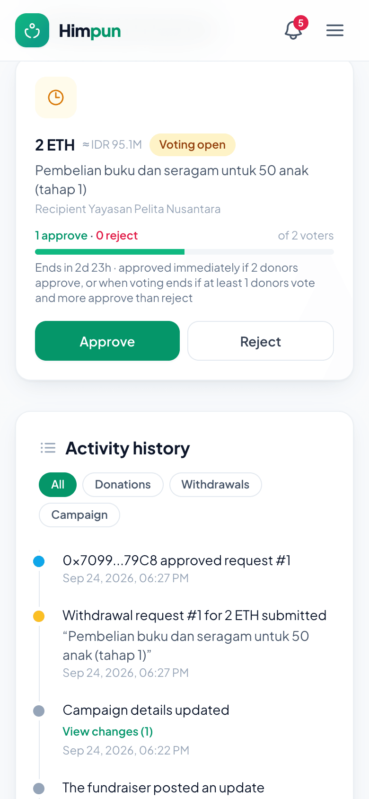
</p>

_Taken on a local Hardhat node with the demo data from `npm run seed:local`._

## Project structure

```
.
├── smart-contract/          Solidity 0.8.24 + Hardhat
│   ├── contracts/           Crowdfunding.sol (registry & moderation), Project.sol (one campaign)
│   ├── scripts/             deploy.js, seed.js (demo data), export-abi.js
│   └── test/                Contract unit tests
├── frontend/                Next.js 15 + React 18 + Tailwind + Redux + ethers v6
│   ├── pages/               /, /dashboard, /stats, /admin, /my-contributions, /project-details/[id], /creators/[address]
│   ├── components/          layout/, ui/, campaign/, withdraw/, charts/, landing/, profile/, providers/
│   ├── lib/                 config, format, campaign (rules), chain/ (blockchain access), i18n/, abi/, ...
│   ├── hooks/               useWallet, useTransaction, useBlockRefresh, useNow, useScrollMotion
│   ├── store/               Redux: wallet, latest block & campaign list
│   └── __tests__/           Frontend unit tests (Jest + Testing Library)
├── docs/                    ATURAN.md (platform rules), ARSITEKTUR.md (how the code works)
└── .github/workflows/ci.yml Tests, coverage, Slither, lint, build, and format check
```

## Features

- **Campaigns**: category, cover image (URL), story, goal, minimum donation, province, and deadline
- **Explore**: filter by status, category and province, search, sorting (newest, ending soon, most raised, progress), pagination
- **Donations** with a support message (max. 280 characters), an Indonesian Rupiah estimate, and donation history
- **Top donors** (🥇🥈🥉), a **donation progress chart**, and a full **activity history** per campaign
- **Favorites**: save campaigns with the ♥ button (stored in the browser), then filter by _Favorites_
- **Search** by title, story, fundraiser profile/ENS name, or wallet address
- **Campaign management**: edit story, image, category and province (with a before/after **edit history**), extend the deadline once, close donations early, cancel the campaign
- **Withdrawal voting** (approve/reject) with vote progress, deadline, and quorum
- **Updates** from the fundraiser, stored permanently on-chain
- **Fund transparency**: raised / withdrawn / remaining, plus proof of each withdrawal transaction
- **Refunds**: donors reclaim the remaining balance when a campaign is cancelled, taken down, or abandoned
- **Moderation**: public reports, a _Verified_ badge, admin **takedown**, and a takedown **appeal**
- **Notifications** (bell icon): donations & votes on your campaigns, withdrawal requests & updates from campaigns you support or follow, appeal decisions, and **reminders** for favorites ending within 3 days
- **Profile names & ENS**: wallet addresses are shown as an on-chain profile name or an ENS name
- **Platform stats** (`/stats`): total raised, unique donors, donations per day, funds per category, top campaigns and donors
- **Fundraiser profile** (`/creators/<address>`): total raised, unique donors, daily donation chart
- **Admin panel** (`/admin`): reported campaigns, verification queue, appeals, and taken-down campaigns
- **Share button** (copy link, WhatsApp, X, Telegram, Facebook) with a **link preview** (title, description, and an auto-generated progress image via `/api/og`)
- **Indonesian / English** and **dark mode**: toggles in the navbar, remembered in the browser
- **Real-time**: data refreshes automatically on every new transaction, without reloading the page
- **Connection status**: connect wallet button, wrong-network warning, and a message when the blockchain is unreachable

## Platform rules

**Funding model: keep-it-all.** The fundraiser may withdraw whatever has been raised without reaching the goal, but **every withdrawal needs donor approval**.

| Rule          | Summary                                                                               |
| ------------- | ------------------------------------------------------------------------------------- |
| Donations     | Open until the deadline, at least the campaign's minimum donation                     |
| Withdrawals   | Require a reason, then a 3-day donor vote                                             |
| Approved when | More than 50% of donors approve, or after 3 days with a 20% quorum and more approvals |
| Refunds       | Campaign cancelled, taken down, or the fundraiser inactive for 30 days                |
| Moderation    | Public reports, verified badge, admin takedown, and one appeal within 14 days         |

Full details (voting outcome table, abandoned funds, how refunds are calculated, appeals) are in **[docs/ATURAN.md](docs/ATURAN.md)**. How the code works is described in **[docs/ARSITEKTUR.md](docs/ARSITEKTUR.md)**. Both documents are written in Indonesian.

## Requirements

- Node.js 20
- A browser with the [MetaMask](https://metamask.io/download/) extension

## Running locally

First, install every dependency from the project root:

```bash
npm run install:all
```

Then open **two terminals** in the project root:

```bash
# Terminal 1 — local blockchain (leave it running)
npm run node
```

```bash
# Terminal 2 — deploy contracts, seed demo data, start the frontend
npm run deploy:local
npm run seed:local   # optional: 3 campaigns, donations, an update, and 1 verified campaign
npm run dev
```

Open http://localhost:4000 and click **Connect MetaMask**.

> Every time `npm run node` restarts, the blockchain is empty again. Re-run `deploy:local` (and `seed:local`), then reset MetaMask (see below).

**Dev mode without MetaMask.** On the local chain (id 31337), a browser without MetaMask automatically uses Hardhat's Account #0 (marked `dev` in the navbar). Handy for a quick look; use MetaMask to switch accounts.

## MetaMask setup

The network is offered automatically when you connect your wallet. To add it manually:

| Field           | Value                   |
| --------------- | ----------------------- |
| Network name    | Hardhat Localhost       |
| RPC URL         | `http://127.0.0.1:8545` |
| Chain ID        | `31337`                 |
| Currency symbol | ETH                     |

**Test accounts.** `npm run node` prints 20 accounts holding 10,000 ETH each, along with their private keys. Import a few into MetaMask (_Add account → Import account_). The demo data from `seed:local` uses:

| Campaign                          | Creator    | Donors         | Notes                       |
| --------------------------------- | ---------- | -------------- | --------------------------- |
| Beasiswa untuk 50 anak di pelosok | Account #0 | Account #1, #2 | Has one update and one edit |
| Renovasi perpustakaan desa        | Account #1 | Account #0     |                             |
| Air bersih untuk Nusa Tenggara    | Account #2 | Account #3     | Goal reached, verified      |

Account #0 is also the admin (the deployer account).

> Hardhat private keys are public. Never use them on a real network.

**After restarting the node**, transactions can fail because of stale nonces. Open MetaMask → _Settings → Advanced → Clear activity tab data_.

## Frontend configuration (`frontend/.env.local`)

The defaults already match a local Hardhat node. If the contract address or the network differs (for example when deploying to a testnet):

```bash
cp frontend/.env.example frontend/.env.local   # edit the values, then restart `npm run dev`
```

| Variable                           | Default                                                                                       |
| ---------------------------------- | --------------------------------------------------------------------------------------------- |
| `NEXT_PUBLIC_CROWDFUNDING_ADDRESS` | `0x5FbDB2315678afecb367f032d93F642f64180aa3`                                                  |
| `NEXT_PUBLIC_CHAIN_ID`             | `31337`                                                                                       |
| `NEXT_PUBLIC_RPC_URL`              | `http://127.0.0.1:8545`                                                                       |
| `NEXT_PUBLIC_NETWORK_NAME`         | `Hardhat Localhost`                                                                           |
| `NEXT_PUBLIC_EXPLORER_URL`         | empty. Set e.g. `https://sepolia.etherscan.io` to turn transaction hashes into links          |
| `NEXT_PUBLIC_ENS_RPC_URL`          | Ethereum mainnet RPC for ENS names & avatars (defaults to publicnode). Leave empty to disable |
| `NEXT_PUBLIC_APP_URL`              | empty. Public address of the app, used for _Share_ links and link previews                    |

**The Rupiah estimate** comes from the public CoinGecko API (ETH/IDR rate, cached for 5 minutes). If it fails to load (when offline, for instance) the Rupiah value is hidden and the app keeps working. On a local or test network ETH has no monetary value, so the Rupiah figure is illustrative only.

## Commands

Run all of these from the project root.

| Command                | What it does                                                |
| ---------------------- | ----------------------------------------------------------- |
| `npm run install:all`  | Install dependencies for root, `smart-contract`, `frontend` |
| `npm run node`         | Start the local blockchain (Hardhat)                        |
| `npm run deploy:local` | Deploy the contracts to the local node                      |
| `npm run seed:local`   | Seed demo data                                              |
| `npm run dev`          | Frontend at http://localhost:4000                           |
| `npm test`             | Contract tests (Hardhat) and frontend tests (Jest)          |
| `npm run lint`         | ESLint for the frontend                                     |
| `npm run build`        | Production build of the frontend                            |
| `npm run format`       | Format every file (Prettier, including Solidity)            |
| `npm run format:check` | Check formatting without changing files                     |

Smart-contract specific commands (run them with `npm --prefix smart-contract run <command>`):

| Command    | What it does                                                                           |
| ---------- | -------------------------------------------------------------------------------------- |
| `compile`  | Compile the contracts; the ABI and rule constants in `frontend/lib/abi/` are refreshed |
| `coverage` | Test coverage report (`smart-contract/coverage/`)                                      |
| `test:gas` | Tests plus a gas cost report per function                                              |
| `slither`  | Static security analysis (requires [Slither](https://github.com/crytic/slither))       |

After changing a contract, run `compile` and deploy again.

**Rule constants** (`VOTING_PERIOD`, `QUORUM_PERCENT`, `ABANDON_PERIOD`, `MAX_EXTENSION`, `APPEAL_PERIOD`, text length limits) live only in Solidity. `compile` exports them to `frontend/lib/abi/rules.json`, and the frontend derives every constant from that file, so no number has to be kept in sync by hand.

## Continuous integration

`.github/workflows/ci.yml` runs on every push to `main`/`master` and on every pull request:

- **Smart contract**: `npm test` and `npm run coverage`
- **Slither**: static security analysis, failing on _medium_ severity and above
- **Frontend**: `npm run lint`, `npm test`, `npm run build`
- **Format**: `npm run format:check`

## Troubleshooting

| Problem                               | Fix                                                                                              |
| ------------------------------------- | ------------------------------------------------------------------------------------------------ |
| Red banner "cannot connect"           | Make sure `npm run node` is running and `npm run deploy:local` ran after the last node restart   |
| Yellow banner "wrong network"         | Click _Switch to Hardhat Localhost_ in the banner                                                |
| "Failed to connect to MetaMask"       | Unlock MetaMask, disable other wallet extensions, then reload the page                           |
| 0 ETH balance in MetaMask             | Check that the _Hardhat Localhost_ network is selected and a Hardhat account was imported        |
| Transaction fails / nonce error       | _Settings → Advanced → Clear activity tab data_                                                  |
| `Error HH700: Artifact ... not found` | Hardhat cache is out of sync. Run `npx hardhat clean` then `npm run compile` in `smart-contract` |

## License

[MIT](LICENSE)
